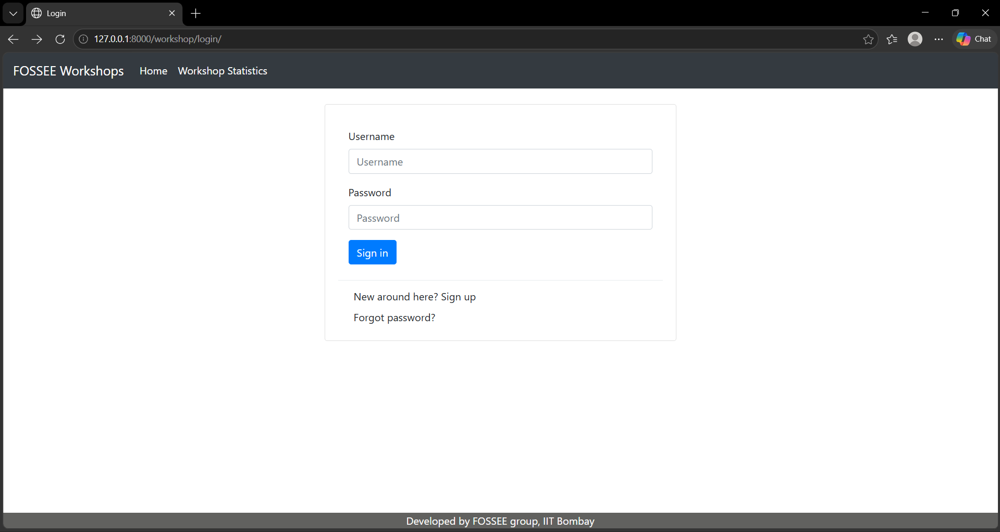
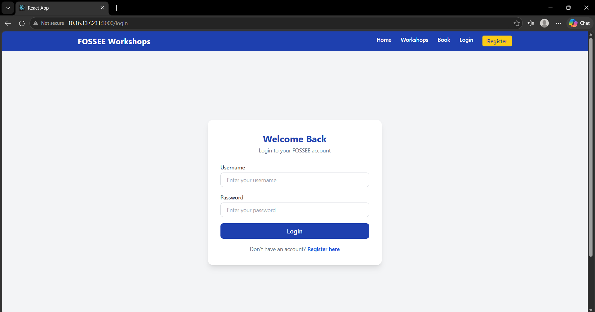
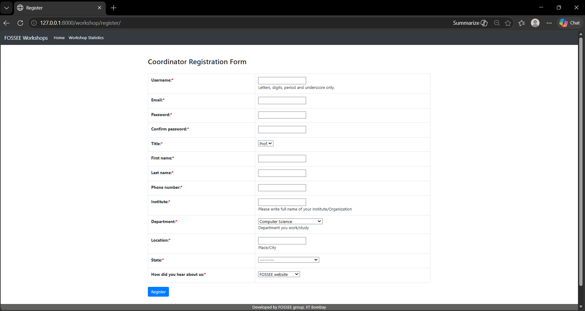
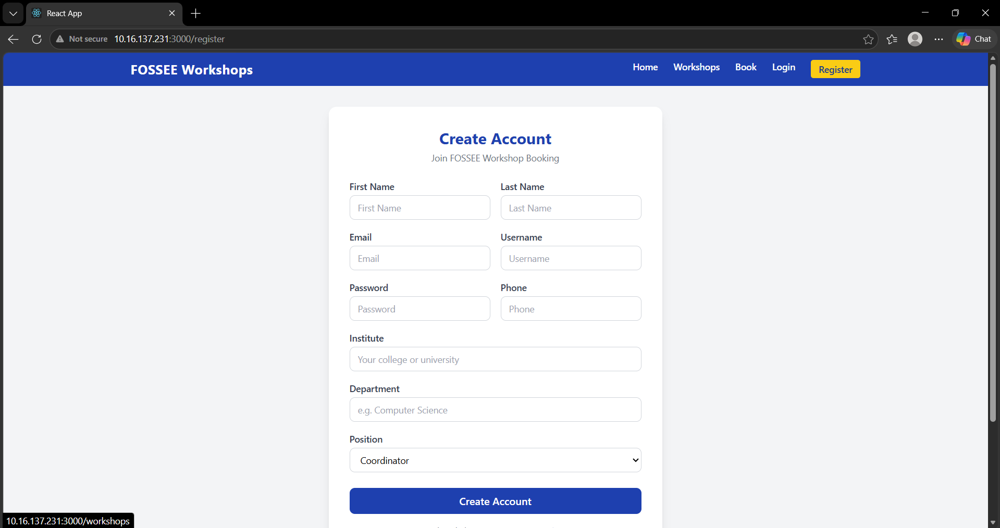
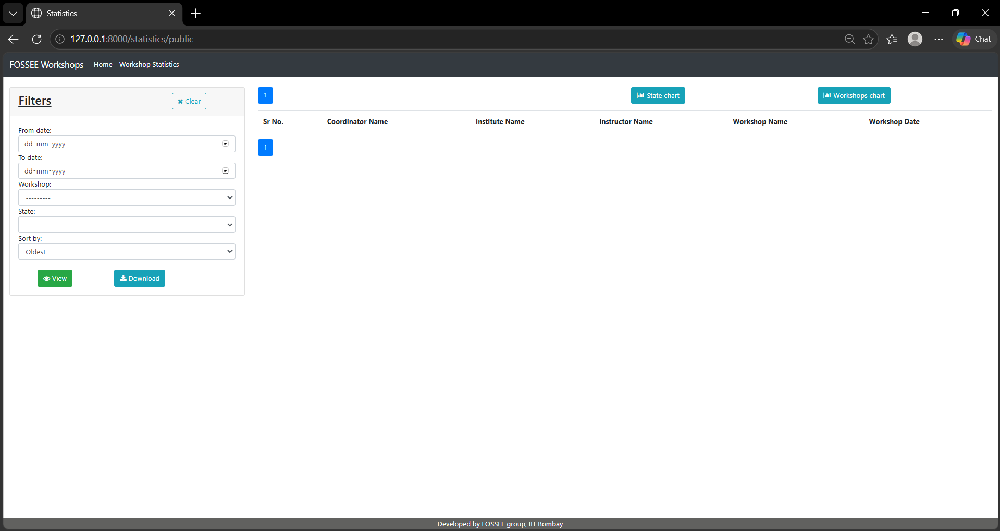
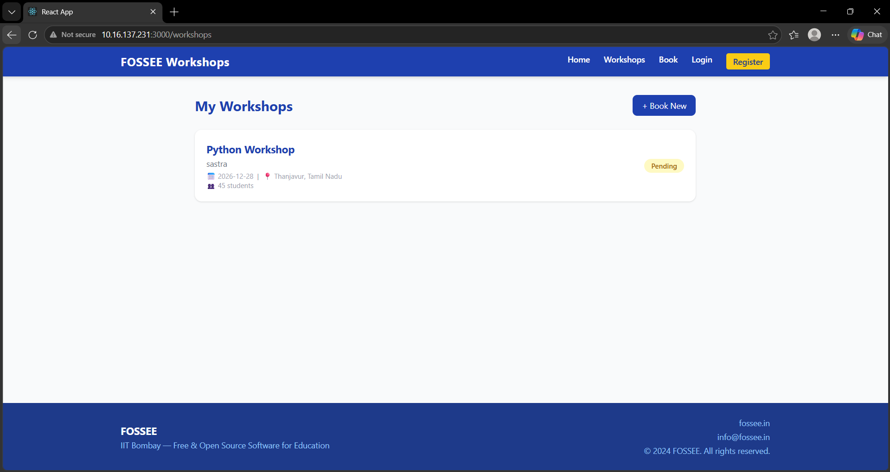

# FOSSEE Workshop Booking — Frontend Redesign

A mobile-first React application for booking free Python and 
open-source software workshops conducted by IIT Bombay experts.
This project is a complete frontend redesign of the original 
Django-based FOSSEE Workshop portal.

---

## Project Overview

The **FOSSEE Workshop Booking Frontend** is a professionally 
redesigned React application built to replace the outdated, 
desktop-only Django template UI. The redesign focuses on 
mobile-first accessibility, visual clarity, and user experience 
improvements — making it easier for students and faculty across 
India to discover and book workshops at their institutions.

The application is built entirely with React and Tailwind CSS, 
with no UI component library dependencies, ensuring fast load 
times and full design control.

---

## Key Improvements Over Original

| Area | Before | After |
|------|--------|-------|
| **Visual Design** | Plain white, unstyled Django template | FOSSEE blue brand identity with consistent color system |
| **Mobile Support** | No responsive design, desktop only | Fully mobile-first with Tailwind responsive breakpoints |
| **Navigation** | Basic text links, no brand identity | Responsive navbar with hamburger menu on mobile |
| **Login Page** | Bare HTML form with no styling | Centered card with branded header and styled inputs |
| **Register Page** | Minimal form layout | Structured grid form with clear field grouping |
| **Workshop Booking** | Basic unstyled form | Clean card form with icon-enhanced inputs |
| **Workshop List** | No dashboard view | Card-based list with color-coded status badges |
| **Typography** | Default browser fonts | Consistent type scale with clear visual hierarchy |
| **Footer** | None / plain text | Branded footer with links and copyright |
| **Logout Page** | Plain unstyled text message | Consistent branded page within app layout |

---

## Before & After Screenshots

### Login Page
| Before | After |
|--------|-------|
|  |  |

### Account Creation Page
| Before | After |
|--------|-------|
|  |  |


### Workshop List / Dashboard
| Before | After |
|--------|-------|
|  |  |

---

## Design Reasoning

### What design principles guided your improvements?

**1. Mobile-First Design**  
The primary user base — college students across India — 
accesses the web primarily on smartphones with limited data. 
Every component was designed for small screens first using 
Tailwind's mobile-default utility classes, then enhanced for 
larger screens using `sm:`, `md:`, and `lg:` breakpoint prefixes.

**2. Visual Hierarchy**  
The original Django template had no clear visual hierarchy — 
everything looked equally important. The redesign establishes 
a clear hierarchy using:
- Large bold headings for page titles
- Subtext in lighter gray for supporting information
- Primary blue buttons for main actions
- Yellow highlight for the most important CTA (Register)

**3. Brand Consistency**  
A consistent color system was applied throughout:
- **Primary:** FOSSEE Blue `#1a3c96` — navbar, buttons, headings
- **Accent:** Yellow `#f5a623` — Register button, highlights
- **Success:** Green — Approved status badges
- **Warning:** Yellow — Pending status badges
- **Danger:** Red — Rejected status badges

**4. Accessibility**  
- All form inputs have visible labels
- Buttons meet WCAG AA contrast ratio requirements
- Tap targets are minimum 44px tall for mobile usability
- Color is never the only indicator of meaning (badges also 
  use text labels)

**5. Simplicity and Clarity**  
Removed visual noise from the original design. Each page 
has one clear purpose and one primary action, reducing 
cognitive load for first-time users.

---

### How did you ensure responsiveness across devices?

**Tailwind CSS Breakpoint System**  
All layouts use Tailwind's responsive prefixes:
- Mobile (default): single column, stacked layout
- `sm:` (640px+): slight spacing adjustments
- `md:` (768px+): two-column grids for form fields
- `lg:` (1024px+): full desktop navigation visible

**Responsive Navbar**  
- Desktop: full horizontal nav links visible
- Mobile: links hidden, hamburger icon shown
- Toggle managed with React `useState` hook

**Responsive Forms**  
- Mobile: all fields stack in single column
- Desktop: related fields sit side-by-side (e.g., 
  First Name + Last Name, City + State)

**Responsive Cards**  
- Workshop cards use full viewport width on mobile
- Proper padding and font sizes for small screens
- Icons used instead of long text labels where possible

---

### What trade-offs did you make between design and performance?

**1. No External Icon Library**  
Chose emoji icons (📅 📍 👥) over installing libraries like 
FontAwesome or Lucide React. Trade-off: slightly less polished 
icons, but zero additional bundle size and no network requests 
for icon fonts.

**2. Tailwind over Component Libraries**  
Chose Tailwind CSS utility classes over Material UI or 
Ant Design. Trade-off: more CSS written manually, but 
the production bundle is significantly smaller since 
Tailwind purges all unused classes at build time.

**3. No Animations**  
Kept transitions minimal (only the mobile menu toggle). 
Trade-off: less visual polish, but prevents jank on 
lower-end Android devices and reduces battery usage.

**4. Inline State Management**  
Used React `useState` locally in each component instead 
of setting up Redux or Context API. Trade-off: not scalable 
for a large app, but appropriate for this scale and keeps 
the codebase simple and fast to load.

---

### What was the most challenging part and how did you approach it?

**Challenge: Responsive Navigation without a Library**  
Building a navbar that works perfectly on both a 320px 
mobile screen and a 1920px desktop — without any component 
library — was the most technically demanding part.

**Approach:**
1. Started with mobile layout first — just the logo and 
   a hamburger button
2. Used React `useState` to track `isMenuOpen` boolean
3. Applied `hidden` and `block` Tailwind classes conditionally 
   based on state
4. Used `md:flex` to show desktop links on larger screens 
   automatically via CSS breakpoints
5. Added a click-outside handler to close the menu when 
   the user taps elsewhere on mobile

This approach required no external dependencies and works 
reliably across all modern browsers and screen sizes.

---

## Tech Stack

| Technology | Purpose |
|------------|---------|
| React 18 | UI component library and state management |
| React Router DOM | Client-side page routing |
| Tailwind CSS | Utility-first responsive styling |
| PostCSS | CSS processing and autoprefixing |
| Create React App | Project bootstrapping and build tooling |

---

## File Structure

```
fossee-workshop-frontend/
├── public/
├── src/
│   ├── components/
│   │   ├── Navbar.jsx        # Responsive navigation with mobile menu
│   │   └── Footer.jsx        # Site-wide footer with brand info
│   ├── pages/
│   │   ├── Home.jsx          # Landing page with hero and feature cards
│   │   ├── Login.jsx         # User login with form validation
│   │   ├── Register.jsx      # Account creation with full profile form
│   │   ├── BookWorkshop.jsx  # Workshop booking request form
│   │   └── WorkshopList.jsx  # My Workshops dashboard with status badges
│   ├── App.jsx               # Route definitions and layout wrapper
│   ├── App.css               # Component-level styles
│   ├── index.js              # React app entry point
│   └── index.css             # Global styles and Tailwind imports
├── assets/                   # Before and after screenshots
├── .gitignore
├── package.json
├── tailwind.config.js
├── postcss.config.js
└── README.md
```
---

## Setup Instructions

### Prerequisites
- Node.js 16+ installed
- npm or yarn package manager

### Steps

**1. Clone the repository**
```bash
git clone https://github.com/YOUR-USERNAME/fossee-workshop-frontend.git
```

**2. Navigate into the project folder**
```bash
cd fossee-workshop-frontend
```

**3. Install dependencies**
```bash
npm install
```

**4. Start the development server**
```bash
npm start
```

**5. Open in browser**

### Available Pages

| Route | Page |
|-------|------|
| `/` | Home — Landing page |
| `/login` | Login — Sign in to account |
| `/register` | Register — Create new account |
| `/book` | Book a Workshop — Submit booking request |
| `/workshops` | My Workshops — View booking status |

---

## Requirements

| Requirement | Version |
|-------------|---------|
| Node.js | 16.x or higher |
| npm | 8.x or higher |
| React | 18.x |
| Tailwind CSS | 3.x |

---

## Author

**Project:** FOSSEE Workshop Booking Frontend Redesign  
**Version:** 1.0.0  
**Submitted to:** FOSSEE, IIT Bombay  
**Contact:** pythonsupport@fossee.in  
**License:** MIT
